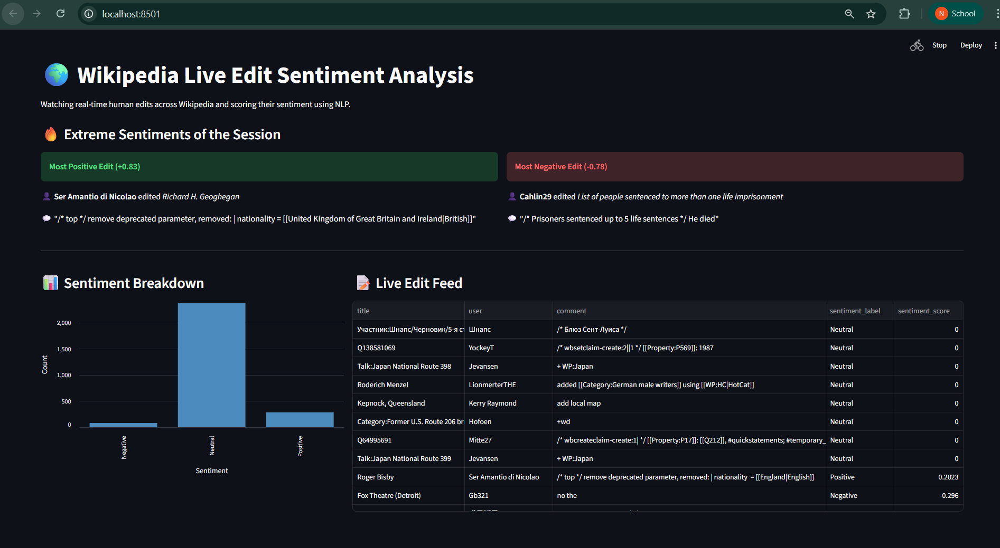

# 🌍 Real-Time Wikipedia Edit Sentiment Pipeline

A complete real-time data engineering pipeline that taps into Wikipedia's live Server-Sent Events (SSE) firehose, analyzes the natural language sentiment of editor comments using Apache Spark, and visualizes the results on a live dashboard.

## 🏗️ Architecture & Tech Stack

* **Data Source:** Wikipedia Recent Changes Firehose (SSE).
* **Ingestion (Producer):** Python script filtering for human edits and pushing to Kafka.
* **Message Broker:** Apache Kafka (KRaft Mode).
* **Stream Processing & NLP:** Apache Spark Streaming applying VADER Sentiment Analysis via User Defined Functions (UDFs).
* **Database:** PostgreSQL for storing the analyzed text and scores.
* **Dashboard:** Streamlit for a live, auto-refreshing UI tracking extreme sentiments and broader trends.


## ⚙️ Prerequisites
* Docker & Docker Compose
* Python 3.9+
* Required packages: `confluent_kafka`, `pyspark`, `streamlit`, `pandas`, `psycopg2-binary`, `sseclient-py`, `vaderSentiment`, `requests`

## 🚀 How to Run the Pipeline

**1. Spin up the Infrastructure**
Start Postgres, Kafka, and the Spark Cluster:
```bash
docker compose up -d
```

**2. Install NLP Dependencies on the Cluster**
Install the VADER sentiment library directly into the Spark containers:
```bash
docker exec -it spark-master pip install vaderSentiment
docker exec -it spark-worker pip install vaderSentiment
```

**3. Start the Wikipedia Firehose**
Run the producer to start listening to global Wikipedia edits and streaming them to Kafka:
```bash
python wiki_producer.py
```

**4. Start the Spark NLP Job**
Open a new terminal and submit the Spark job to process the text in real-time:
```bash
docker exec -it spark-master spark-submit --packages org.apache.spark:spark-sql-kafka-0-10_2.12:3.5.0,org.postgresql:postgresql:42.6.0 /app/spark_processor.py
```

**5. Launch the Live Dashboard**
In a final terminal, launch Streamlit to watch the sentiments analyze live:
```bash
streamlit run app.py
```

## 📸 Dashboard Preview

*(Drop a screenshot of your running Streamlit dashboard into your project folder, name it `dashboard.png`, and it will appear here!)*



## 💡 Lessons Learned
* Tapped into raw Server-Sent Events (SSE) bypassing the need for standard REST APIs.
* Deployed Python NLP libraries (`vaderSentiment`) directly into distributed Apache Spark nodes.
* Used PySpark User Defined Functions (UDFs) to apply machine learning to an active Kafka stream before landing it in a PostgreSQL database.